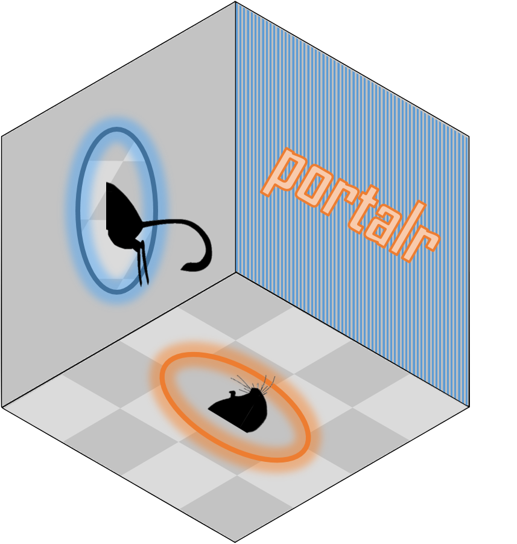

<!-- README.md is generated from README.Rmd. Please edit that file -->

```{r, echo = FALSE}
knitr::opts_chunk$set(
  collapse = TRUE,
  comment = "#>",
  fig.path = "man/figures/"
)
```

# portalr

[](https://travis-ci.org/weecology/portalr)
[](https://doi.org/10.5281/zenodo.1429290)
[](https://raw.githubusercontent.com/weecology/portalr/master/LICENSE)



## Overview 

The **portalr** package provides collection of basic functions to summarize the Portal porject data on rodents, plants, ants, and weather at our long-term field site in the Chihuahuan Desert. The data begin in 1977 and are continuously updated today. There are functions to summarize rodent abundance, biomass, or energy and by site, plot, or treatment type. There are functions to summarize the weather data collected from our automated weather stations and plant data that is collected each summer and fall.

## Installation

You can install portalr from github with:

```{r gh-installation, eval = FALSE}
# install.packages("devtools")
devtools::install_github("weecology/portalr")
```

## Examples

1. Load all data tables from the [PortalData GitHub repo](https://github.com/weecology/portalData):

```{r load data from repo, eval = FALSE}
data_tables <- load_data("repo")
```

2. Download and generate summaries of rodent abundance and biomass:

```{r download and summarize rodent data, eval = FALSE}
download_observations(".")

rodent_data <- abundance(".") # default grouping is by sampling period

rodent_biomass_by_plot <- biomass(".", level = "plot", type = "granivores", 
shape = "flat", time = "date")
```

3. Retrieve weather data:

```{r weather data, eval = FALSE}
weatherdata <- weather("Monthly", ".")
```

For more detailed info, checkout the vignettes associated with the package:
```{r browse vignettes, eval = FALSE}
browseVignettes("portalr")
```

## More Information

#### [Portal Data Repo](github.com/weecology/PortalData) 
The data repo contains useful details for issues with data collection, and background on why we handle them the way we do. Of course, it also contains the raw data, if you would like to create more complex data summaries than what is provided here.

#### [The Portal Project](portal.weecology.org/)
Find a list of previous publications using the Portal data at our website.

#### [The Portal Blog](portalproject.wordpress.com/)
Follow our blog to get the latest news on what is happening with our project and at the site.
