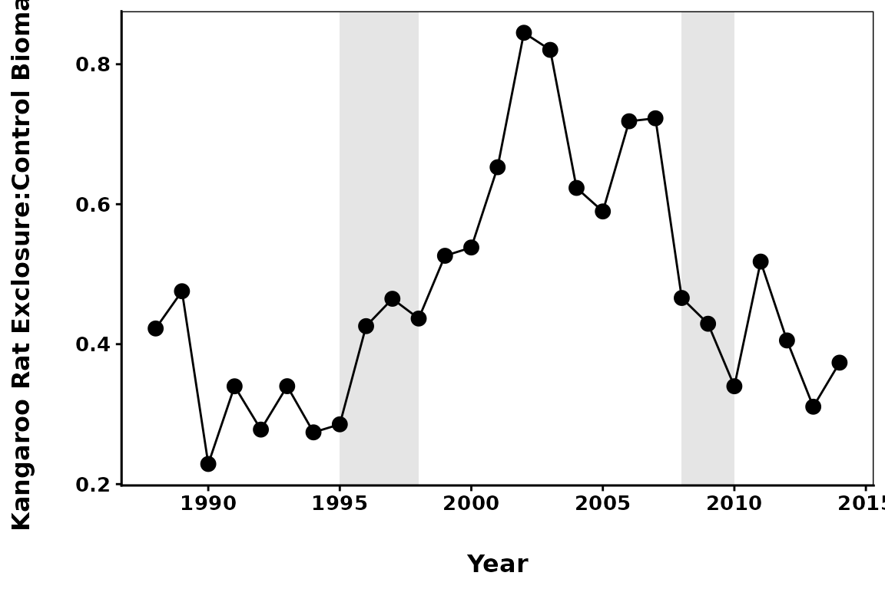

# Examples of How Portal Researchers Are Using the Package

## Introduction

The `portalr` package started out as a series of scripts used by Portal
researchers to quickly and consistently summarize the [Portal
data](https://github.com/weecology/PortalData). It has developed from
there into a formalized package, dealing with all the quirky data
manipulation under the hood. Now, the researchers who are currently
collecting data at Portal have started actively using the package in
their own work. Some examples of how we are using the package are
included below.

### Installing the Package

First, we need to install the `portalr` package if we haven’t done so
already. We’ll also load `tidyverse`, which has many packages for data
manipulation and plotting.

``` r
#devtools::install_github("weecology/portalr")
library(portalr)
library(dplyr)
library(tidyr)
library(ggplot2)
```

  

## Rodent Biomass Ratios between Plot Treatment Types

One thing we can do with the Portal rodent data is look at the ratio of
biomass between the control plots and the kangaroo rat exclosure plots
and how it has changed through time.

### Getting the Data We Want

Because we are going to compare biomass between plot types, we need to
know the biomass on each plot. To achieve this, we can set
`level = "plot"`

``` r
biomass_data <- portalr::summarize_rodent_data(path = "repo", 
                                         level = "plot", 
                                         output = "biomass",
                                         time = "date")
```

Note that the `path` argument in the `summarize_rodent_data` function
has been set to “repo.” While you can choose the download all of the
Portal data onto your local computer and then load the data into R, you
can also get the data directly from the GitHub repository by setting
`path = "repo"` as we’ve done here.

The data structure will look like this, with columns for the date,
treatment, plot number, and each species:

| censusdate | plot | treatment |  BA |  DM |  DO |  DS |  NA |  OL |  OT |
|:-----------|-----:|:----------|----:|----:|----:|----:|----:|----:|----:|
| 2024-12-07 |   19 | exclosure |   0 |   0 |   0 |   0 |   0 |   0 |   0 |
| 2024-12-07 |   20 | exclosure |   0 |   0 |   0 |   0 |   0 |   0 |   0 |
| 2024-12-07 |   21 | exclosure |   0 |  26 |   0 |   0 |   0 |   0 |   0 |
| 2024-12-07 |   22 | exclosure |   0 |   0 |   0 |   0 |   0 |   0 |   0 |
| 2024-12-07 |   23 | removal   |   0 |   0 |   0 |   0 |   0 |   0 |   0 |
| 2024-12-07 |   24 | control   |   0 |  41 |   0 |   0 |   0 |   0 |  26 |

### Working with the Data

Let’s select only the rows we want:

- Based on information about the plot treatment switches that can be
  found in this [Readme
  file](https://github.com/weecology/PortalData/tree/main/SiteandMethods)
  in the PortalData repo, we want to select censuses in the years
  1988-2014; to make the data a bit easier to work with, we can also
  split the date column into three separate columns and then filter on
  the year column.

- Since we are comparing control plots and exclosure plots, we can also
  filter for only those treatment types.

``` r
biomass_data <- biomass_data %>% 
  # split the date column into year, month, and day
  separate(col = censusdate, into = c("year", "month", "day"), sep = "-") %>% 
  filter(year >= 1988 & year < 2015,                         # filter by year
         treatment == "control" | treatment == "exclosure")  # filter by treatment type
```

We can get the total biomass for each plot per census by summing the
mass of all the species per row. From there, we will sum by year for
each treatment type. Then, we can create the exclosure:control ratio.

``` r
# compute total biomass per year and treatment
biomass_total <- biomass_data %>%
  gather(species, biomass, BA:SO) %>%
  group_by(year, treatment) %>%
  summarize(totals = sum(biomass, na.rm = TRUE))

# make a column with the exclosure:control ratio
biomass_ratio <- biomass_total %>%
  spread(treatment, totals) %>%
  mutate(EX_to_CO_ratio = exclosure / control) %>%
  ungroup()
```

### Plotting the Ratios

We can finally plot the data!



Before the mid-1990s, biomass on the kangaroo rat exclosures never went
above 50% of the biomass found in the control plots; the small
granivores just couldn’t keep up with the larger kangaroo rats. When a
larger pocket mouse, *Chaetodipus baileyi*, showed up in the system
(first gray bar), they were found primarily in the kangaroo rat
exclosures. This increased the biomass ratio to above 80% of that found
in the control plots. As *C. baileyi* left the system (second gray bar),
the ratio returned to similar levels as before their arrival.  
  
  

## Working with Plant Data

While the rodent community data is the most frequently utilized data
from the Portal Project, we can also use `portalr` to get plant or ant
data from the site. We’ve been running some multivariate statistics on
plant composition in the plots and looking for differences between
rodent treatment types. This is how we get the data we need to do that.

### Getting the Data We Want

Our site has two rainy periods and, therefore, two communities of annual
plants. Let’s say we want to take a look at the abundance of the
*winter* annuals in the system, and we want to see if they differ by
treatment type. We can use the `summarize_plant_data` function to get
the appropriate data.

``` r
plant_data <- portalr::summarize_plant_data(path = 'repo', level = 'plot',
                                            type = 'winter-annual', correct_sp = TRUE,
                                            unknowns = FALSE, shape = 'flat', 
                                            output = 'abundance')
```

What do some of these arguments mean? As above, `path = 'repo'` pulls
the data directly from the online repository. `level = 'plot'` indicates
that we want the data to be summarized at the plot level rather than
across the entire site, and `type = 'winter-annual'` will give us only
annual species that can be found in the winter months. Sometimes in the
past, we have misidentified a species of plant; `correct_sp = TRUE` goes
through the data and corrects the species name to what we now know to be
the correct species. Other times, we just don’t know what a species is,
so it is unknown; if we don’t want those to be included, we use
`unknown = FALSE`. Finally, we want the abundance of each species
returned. Unlike with the rodent abundance, however, we’ve asked for a
flat shape, so the data structure will be in long format and look like
this:

| year | season | plot | species   | abundance | quads | treatment |
|-----:|:-------|-----:|:----------|----------:|------:|:----------|
| 1981 | summer |    1 | ambr arte |         0 |     8 | control   |
| 1981 | summer |    1 | amsi inte |         0 |     8 | control   |
| 1981 | summer |    1 | amsi tess |         0 |     8 | control   |
| 1981 | summer |    1 | andr occi |         0 |     8 | control   |
| 1981 | summer |    1 | astr allo |         0 |     8 | control   |
| 1981 | summer |    1 | astr nutt |         0 |     8 | control   |

Wait a second! Didn’t we ask for winter annuals? So why are the first
few rows all from a summer plant census?

As it turns out, while we have two annual communities of plants, some of
the annuals in our system can be found in both summer AND winter.
Hypothetically, someone might want to know about any and all annual
plants that could be found in the winter: how many of them show up in
the summer, for example?

To get the data we want–just winter annuals found only in the winter
season–we just need one more quick line of code.

``` r
plant_data_winter <- dplyr::filter(plant_data, season == 'winter')
```

| year | season | plot | species   | abundance | quads | treatment |
|-----:|:-------|-----:|:----------|----------:|------:|:----------|
| 1981 | winter |    1 | ambr arte |        NA |     0 | NA        |
| 1981 | winter |    1 | amsi inte |        NA |     0 | NA        |
| 1981 | winter |    1 | amsi tess |        NA |     0 | NA        |
| 1981 | winter |    1 | andr occi |        NA |     0 | NA        |
| 1981 | winter |    1 | astr allo |        NA |     0 | NA        |
| 1981 | winter |    1 | astr nutt |        NA |     0 | NA        |

That’s more like it! Now we have the data we want to run some
multivariate statistics or whatever else you might want to do with the
data.

### Happy coding!
